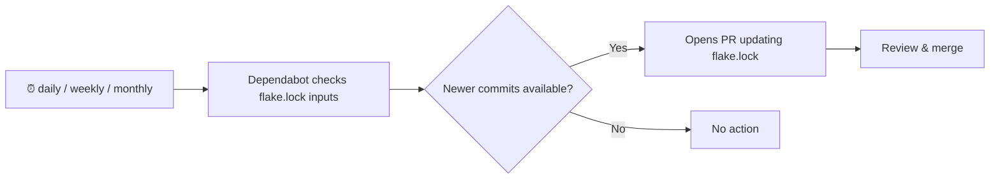

# Dependabot for Nix Flakes

This repository demonstrates how to configure [GitHub Dependabot](https://docs.github.com/en/code-security/dependabot/dependabot-version-updates/configuring-dependabot-version-updates) to automatically keep Nix flake inputs up-to-date.

As of [April 7, 2026](https://github.blog/changelog/2026-04-07-dependabot-version-updates-now-support-the-nix-ecosystem/), Dependabot version updates now support the Nix ecosystem.

## How it works

Dependabot monitors your `flake.lock` file and opens pull requests when any flake input has newer commits available on its tracked branch. Each input gets its own PR equivalent of running `nix flake update`.



This repo's `flake.nix` tracks the `nixos-unstable` branch of `nixpkgs` and exposes GNU Hello as its default package. The `flake.lock` is intentionally pinned to an older `nixpkgs` commit that includes `hello` package version 2.12.2. Since `nixos-unstable` has moved forward and now includes `hello` 2.12.3, Dependabot will detect the outdated input and open a PR to update `flake.lock`.

> **Note:** Dependabot updates flake *inputs* (e.g. the `nixpkgs` revision), not individual packages. The `hello` version bump is a side effect of updating the `nixpkgs` input.

## Try it yourself

### 1. Review `flake.nix`

```nix
{
  inputs = {
    nixpkgs.url = "github:NixOS/nixpkgs/nixos-unstable";
    # Pinned to a commit with hello 2.12.2 — Dependabot will open a PR
    # to update this, picking up hello 2.12.3+ along with other changes.
    # To reset the lock file to this older commit, run:
    #   nix flake update nixpkgs --override-input nixpkgs github:NixOS/nixpkgs/74db1477155674a4c3e18de28628f24eba310ebf
  };

  outputs = { self, nixpkgs }:
    let
      systems = [
        "aarch64-darwin"
        "x86_64-darwin"
        "x86_64-linux"
        "aarch64-linux"
      ];
      forAllSystems = f: nixpkgs.lib.genAttrs systems f;
    in
    {
      packages = forAllSystems (system: {
        default = nixpkgs.legacyPackages.${system}.hello;
      });
    };
}
```

### 2. See the lock file pinned to the older commit

```sh
nix flake update nixpkgs \
  --override-input nixpkgs github:NixOS/nixpkgs/74db1477155674a4c3e18de28628f24eba310ebf
```

This pins `nixpkgs` to commit `74db147` (March 17, 2026), which has `hello` 2.12.2.

### 3. Add the Dependabot configuration

Create `.github/dependabot.yml`:

```yaml
version: 2
updates:
  - package-ecosystem: "nix"
    directory: "/"
    schedule:
      interval: "daily"
```

### 4. Push and trigger Dependabot

Commit everything and push to GitHub. Then trigger Dependabot manually:

Web interface:
1. Go to **Insights > Dependency graph > Dependabot** tab
2. Click **"Check for updates"** next to the `nix` ecosystem entry

gh CLI: 
```sh
gh api repos/<OWNER>/<REPO>/dispatches -f event_type=dependabot
```

Dependabot will see that `nixpkgs` is behind `nixos-unstable` HEAD and open a PR to update `flake.lock`. The updated commit includes `hello` 2.12.3 (among many other package updates).

Make sure the PR exists before proceeding.

### 5. Test the before and after

On the main branch before the PR merge
```sh
git checkout main
nix run . -- --version
hello (GNU Hello) 2.12.2
```

Now see the PR branch
```sh
git checkout main
nix run . -- --version
hello (GNU Hello) 2.12.3
```

### 6. Resetting the demo

After merging the Dependabot PR, you can reset the lock file to replay the demo:

```sh
nix flake update nixpkgs \
  --override-input nixpkgs github:NixOS/nixpkgs/74db1477155674a4c3e18de28628f24eba310ebf
git add flake.lock && git commit -m "Reset nixpkgs to hello 2.12.2 for demo"
git push
```

Then trigger Dependabot again from the UI.

## Repository contents

```
.
├── .github/
│   └── dependabot.yml   # Dependabot configuration
├── flake.nix            # Nix flake tracking nixos-unstable
├── flake.lock           # Pinned to an older nixpkgs commit
└── README.md            # This file